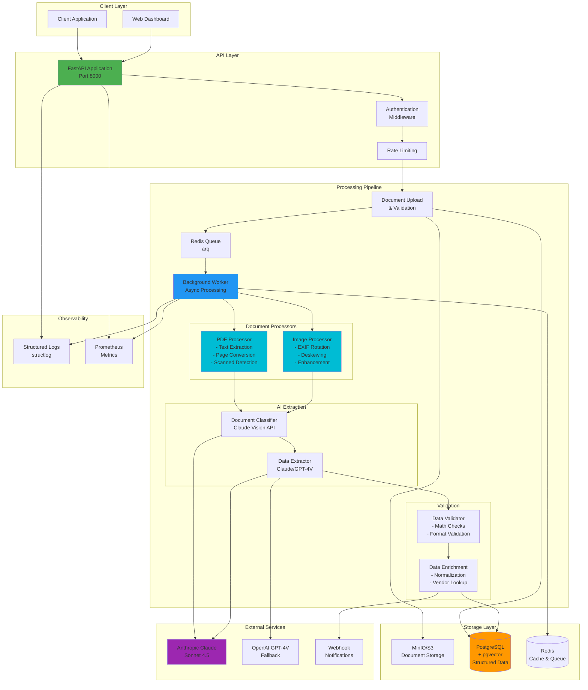
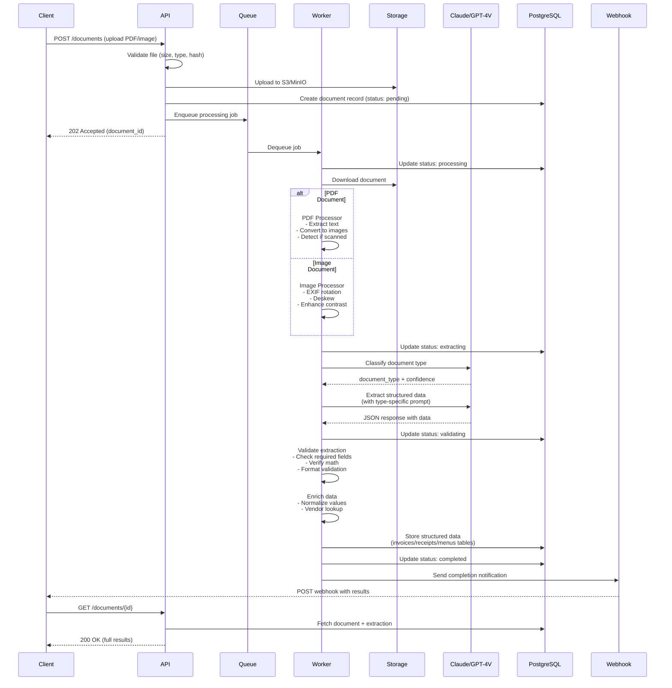
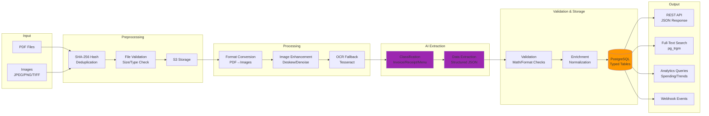
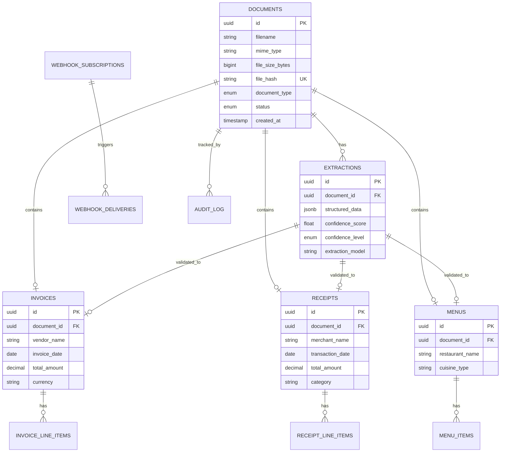

# Document Intelligence Pipeline

A production-grade document intelligence system that automates extraction of structured data from PDFs, images, and scanned documents using vision AI models (Claude Sonnet 4.5 & GPT-4V).

## Features

### Core Capabilities
- **Multi-format Support**: PDF, JPEG, PNG, WebP, TIFF
- **Document Types**: Invoices, receipts, menus, forms, contracts
- **Vision AI Extraction**: Claude Sonnet 4.5 with GPT-4V fallback
- **Advanced Processing**: PDF conversion, image preprocessing, deskewing, OCR fallback
- **Validation & Enrichment**: Automated data validation and enrichment
- **Full-text Search**: PostgreSQL-powered search with fuzzy matching
- **Webhook Notifications**: Real-time updates on processing completion
- **Background Processing**: Async job queue with retry logic
- **Deduplication**: SHA-256 hash-based duplicate detection
- **Audit Trail**: Complete audit log of all operations

### Supported Document Types

#### Invoices
- Vendor and customer information
- Line items with quantities, prices, totals
- Tax, shipping, discounts
- Payment terms and methods

#### Receipts
- Merchant information
- Purchased items
- Payment details
- Automatic categorization

#### Menus
- Restaurant information
- Menu items with prices
- Dietary information (vegetarian, vegan, gluten-free)
- Allergen detection

## Architecture

### System Architecture Diagram



### Processing Flow



### Data Flow Architecture



### Database Schema Overview



## Quick Start

### Prerequisites
- Docker & Docker Compose
- Python 3.11+ (for local development)
- API Keys:
  - Anthropic API key (required)
  - OpenAI API key (optional, for fallback)

### Installation

1. **Clone the repository**
```bash
git clone <repository-url>
cd DocumentIntelligencePipeline
```

2. **Set up environment variables**
```bash
cp .env.example .env
# Edit .env and add your API keys
```

3. **Start with Docker Compose**
```bash
docker-compose up -d
```

This will start:
- PostgreSQL database on port 5432
- Redis on port 6379
- MinIO on ports 9000 (API) and 9001 (Console)
- FastAPI application on port 8000
- Background worker for processing

4. **Run database migrations**
```bash
docker-compose exec api alembic upgrade head
```

5. **Verify installation**
```bash
curl http://localhost:8000/health
```

## API Usage

### Authentication
All API requests require an API key in the header:
```bash
curl -H "X-API-Key: your-api-key" http://localhost:8000/api/v1/documents
```

### Upload Document
```bash
curl -X POST http://localhost:8000/api/v1/documents \
  -H "X-API-Key: your-api-key" \
  -F "file=@invoice.pdf" \
  -F "document_type=invoice"
```

## Project Structure

The project follows a modular architecture with clear separation of concerns:

```
document-intelligence/
├── src/
│   ├── api/              # FastAPI routes, schemas, middleware
│   ├── core/             # Core business logic and exceptions
│   ├── processors/       # PDF and image processing
│   ├── extractors/       # Vision AI extraction logic
│   ├── validators/       # Data validation and enrichment
│   ├── db/               # Database models and repositories
│   ├── storage/          # S3/MinIO storage backends
│   ├── queue/            # Background job processing
│   └── utils/            # Logging, metrics, helpers
├── alembic/              # Database migrations
├── tests/                # Comprehensive test suite
├── scripts/              # Utility scripts
└── docs/                 # Additional documentation
```

## Development Status

This project is a comprehensive implementation with the following components:

✅ **Completed:**
- Project structure and configuration
- Database schema with PostgreSQL + pgvector
- Alembic migrations setup
- Core exception handling
- Utility modules (logging, metrics, hashing, retry)
- PDF processor with advanced features
- Image processor with preprocessing
- Extraction prompts (invoice, receipt, menu, classification)
- Docker and docker-compose setup
- Comprehensive documentation

🚧 **To Be Implemented:**
- Vision extractor (Claude/GPT-4V integration)
- Validators and enrichment logic
- SQLAlchemy database models
- Storage backends (S3/MinIO interface)
- Database repositories
- Core pipeline orchestration
- API schemas (Pydantic models)
- API routes and endpoints
- Background worker and queue tasks
- FastAPI main application
- Test suite

## Next Steps

To continue development:

1. **Implement Vision Extractors** ([src/extractors/vision_extractor.py](src/extractors/vision_extractor.py))
2. **Create Database Models** ([src/db/models/](src/db/models/))
3. **Implement Storage Backends** ([src/storage/](src/storage/))
4. **Build API Layer** ([src/api/](src/api/))
5. **Create Main Application** ([src/main.py](src/main.py))
6. **Write Tests** ([tests/](tests/))

## Configuration

See [.env.example](.env.example) for all configuration options.

Key environment variables:
- `ANTHROPIC_API_KEY`: Required for Claude API
- `DATABASE_URL`: PostgreSQL connection string
- `REDIS_URL`: Redis connection string
- `S3_*`: Storage configuration

## License

[Your License Here]

## Contributing

Contributions are welcome! Please:
1. Fork the repository
2. Create a feature branch
3. Add tests for new functionality
4. Submit a pull request